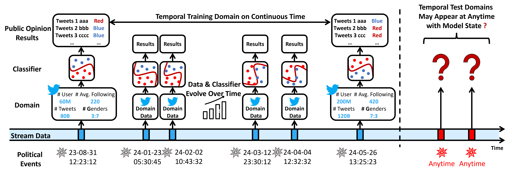
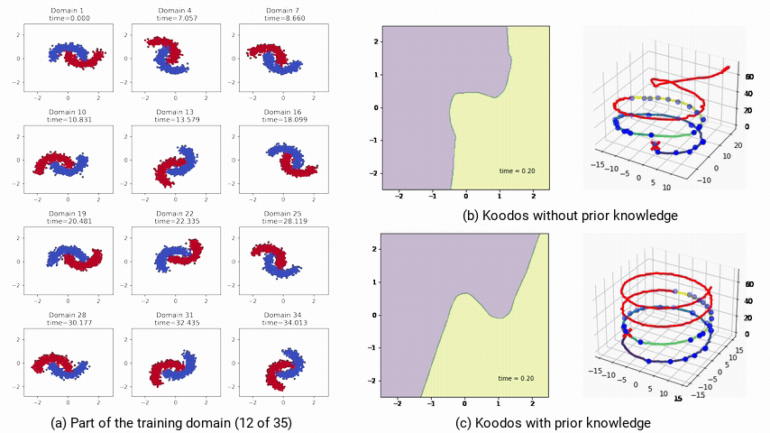

<h1 align="center">[NeurIPS 24] Continuous Temporal Domain Generalization</h1>

</div>

<div align="center">

<a href="https://arxiv.org/abs/2405.16075"></a>
<a href="https://neurips.cc/virtual/2024/poster/95933"></a>
<a href="https://openreview.net/forum?id=G24fOpC3JE"></a>
<a href="https://github.com/Yukayo/LoTNext/blob/main/LICENSE"></a>


**[<a href="https://mp.weixin.qq.com/s/LS9bMKOGmhMDVETMrxyh_Q">中文解读</a>]**
</div>

This repository contains the official code and datasets for the paper, "Continuous Temporal Domain Generalization", accepted by NeurIPS 2024.

**TL;DR**: The study proposes a method capable of generating applicable neural networks at any given moment, based on observing domain data at random time points within a concept drift environment.

<p align="center">
  
</p>

## Abstract
Temporal Domain Generalization (TDG) traditionally deals with training models on temporal domains collected at fixed intervals, limiting their ability to handle continuously evolving, irregular temporal domains. This work introduces Continuous Temporal Domain Generalization (CTDG) and presents Koodos, a model designed to address and optimize this challenge. 

Koodos comprises three key components: 1) Describing the evolution of model parameters by constructing a dynamical system; 2) Modeling complex nonlinear dynamics by Koopman Theory; and 3) Joint optimization of the model and its dynamics.

<p align="center">
  
</p>

## Table of Contents
1. [Installation](#installation)
2. [Quick Demo](#quick-demo)
3. [Usage](#usage)
4. [Code Structure](#code-structure)
5. [Note](#note)
6. [Citation](#citation)
7. [Related Reading](#related-reading)

---

## Installation

To get started, clone the repository and install the required dependencies.

```bash
git clone https://github.com/Zekun-Cai/Koodos.git
cd Koodos
pip install -r requirements.txt
```

### Downloading the Dataset
The datasets used in this project can be downloaded from [Dataset Download Link](https://drive.google.com/drive/folders/1_w4_H-A8qW5Os6ZT2jidLYAa2weFuX1r?usp=sharing). After downloading, please place the files in the ```data``` directory.

## Quick Demo

Before diving into the source code, we provide a Jupyter Notebook [Tutorial_for_Koodos](./Tutorial_for_Koodos.ipynb)  in this repository, **which provides a step-by-step guide to the Koodos framework and demonstrates its core functionality on a sample dataset to give you an intuitive understanding of how it works.**

<p align="center">
  
</p>

## Usage

To train and test the model using the Koodos framework, follow this command:

```bash
python main.py --dataset <dataset-name> --cuda <GPU-No.>
```

Available Datasets: Moons; MNIST; Twitter; YearBook; Cyclone; House.

You can modify the hyperparameters by adjusting the ```param.py``` config file.

## Code Structure

```
|-- data/                # Directory for dataset files
|-- model/               # Directory for dataset-specific model architectures (e.g., Moons, MNIST)
|-- save/                # Directory for storing model outputs and logs
|-- param.py             # Configuration file for various datasets
|-- util.py              # General utility functions file
|-- koodos.py            # Core implementation of the Koodos framework
|-- main.py              # Main program: handles data loading, training, and testing
```

## Note

We have further organized and improved the released code, resulting in enhanced performance. The updated results are as follows:

| Model                | 2-Moons          | Rot-MNIST        | Twitter          | Yearbook         | Cyclone          | House            |
|----------------------|------------------|------------------|------------------|------------------|------------------|------------------|
| Koodos (Paper)   | 2.8 ± 0.7         | 4.6 ± 0.1        | 0.71 ± 0.02      | 6.6 ± 1.3        | 16.4 ± 0.3       | 9.0 ± 0.2         |
| Koodos (Github)  | **1.9 ± 0.7**     | **3.3 ± 0.5**    | **0.71 ± 0.02**  | **5.2 ± 0.3**    | **16.0 ± 0.3**   | **8.9 ± 0.03**    |

1. The running result files for the GitHub code can be found at the following link: [Results Link](https://drive.google.com/drive/folders/1X5NCH_6O7T8_B8F2Azg1UO0r9VQCLx68?usp=drive_link)  
2. The calculation of the table can be viewed in the corresponding notebook: [Notebook](https://github.com/Zekun-Cai/Koodos/blob/main/save/results_summary.ipynb)  


## Citation
If you find our work useful, please cite the following:

```  
@inproceedings{cai2024continuous,
  title={Continuous Temporal Domain Generalization},
  author={Cai, Zekun and Bai, Guangji and Jiang, Renhe and Song, Xuan and Zhao, Liang},
  booktitle = {Advances in Neural Information Processing Systems},
  pages = {127987--128014},
  volume = {37},
  year={2024}
}
```

## Related Reading
[Temporal Domain Generalization with Drift-Aware Dynamic Neural Networks](https://openreview.net/pdf?id=sWOsRj4nT1n), in ICLR 2023.  
[MemDA: Forecasting Urban Time Series with Memory-based Drift Adaptation](https://arxiv.org/abs/2309.14216), in CIKM 2023.

## License

This project is licensed under the MIT License - see the [LICENSE](LICENSE) file for details.
